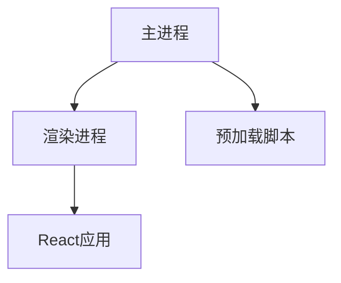

# 项目分析报告

## 1. 项目概述
- **项目名称**: Pokedex Image Manager PWA
- **技术栈**: 
  - React 19 + TypeScript
  - Vite构建工具
  - React Router 7 (HashRouter)
  - Context API状态管理
  - Axios HTTP客户端
- **主要功能**:
  - 分类管理（创建/编辑/删除）
  - 图片上传和管理
  - 标签系统
  - 物种信息展示
  - 数据分析展示
- **PWA特性**:
  - Service Worker实现离线访问
  - Web App Manifest提供安装体验

## 2. 项目结构分析
```
├── components/        # UI组件
├── contexts/          # 状态管理上下文
│   ├── AuthContext.tsx
│   ├── CategoryContext.tsx
│   └── ThemeContext.tsx
├── data/              # 静态数据文件
├── public/            # 公共资源
│   ├── data/          # 静态数据
│   └── icons/         # PWA图标
├── services/          # API服务
│   └── api.ts         # API客户端实现
├── types.ts           # 类型定义
└── vite.config.ts     # Vite配置
```

## 3. 关键特性分析
### 3.1 路由系统
- 使用HashRouter实现路由导航
- 主要路由：
  - `/`：分类列表
  - `/categories/:categoryId`：分类详情
  - `/tags/:tagName`：标签页
  - `/species`：分析页
  - `/login`：登录页

### 3.2 状态管理
- **AuthContext**：管理用户认证状态
- **CategoryContext**：管理分类数据
- **ThemeContext**：管理主题偏好

### 3.3 API交互
- 基于axios的API客户端
- 请求拦截器自动添加JWT令牌
- 统一的错误处理机制
- 支持表单数据上传（图片上传）

### 3.4 PWA实现
- Service Worker注册于`index.tsx`
- 离线页面：`public/offline.html`
- Web App Manifest：`public/manifest.json`

## 4. 数据存储
- 前端使用localStorage存储access_token
- 图片和分类数据通过API与后端交互
- 静态数据（如物种信息）存储在`public/data/`目录

---

# Electron改造方案

## 1. 架构调整
### 1.1 进程模型


- **主进程**：负责窗口管理、原生API调用
- **渲染进程**：运行现有React应用
- **预加载脚本**：在渲染进程中暴露安全的Electron API

### 1.2 代码结构调整
```
pokedex_front/
├── electron/          # Electron相关代码
│   ├── main.js        # 主进程入口
│   └── preload.js     # 预加载脚本
├── public/            # 现有资源
├── src/               # 现有React代码
└── package.json       # 更新脚本和依赖
```

## 2. 核心改造点（基于Electron最佳实践）

### 2.1 安全架构设计
- **禁用Node.js集成**：防止安全风险
```javascript
// main.js
const win = new BrowserWindow({
  webPreferences: {
    nodeIntegration: false, // 显式禁用
    contextIsolation: true, // 启用上下文隔离
    preload: path.join(__dirname, 'preload.js')
  }
})
```

- **安全暴露API**：使用contextBridge安全暴露必要功能
```javascript
// preload.js
const { contextBridge, ipcRenderer } = require('electron')

contextBridge.exposeInMainWorld('electronAPI', {
  readFile: (path) => ipcRenderer.invoke('read-file', path),
  writeFile: (path, content) => ipcRenderer.invoke('write-file', path, content),
  // 仅暴露必要方法，不暴露整个ipcRenderer
})
```

### 2.2 进程间通信(IPC)规范
- **安全通信模式**：使用invoke/handle模式
```javascript
// 渲染进程调用
window.electronAPI.readFile('data.json').then(content => {
  console.log(content)
})

// 主进程处理
ipcMain.handle('read-file', async (event, path) => {
  return fs.promises.readFile(path, 'utf-8')
})
```

- **事件监听安全封装**：
```javascript
// preload.js
contextBridge.exposeInMainWorld('electronAPI', {
  onUpdate: (callback) => ipcRenderer.on('update', (event, data) => callback(data))
})

// 渲染进程使用
window.electronAPI.onUpdate(data => {
  console.log('Received update:', data)
})
```

### 2.3 原生功能集成
- **系统菜单实现**：
```javascript
const { Menu } = require('electron')
const template = [
  {
    label: '文件',
    submenu: [
      { role: 'quit' }
    ]
  },
  {
    label: '编辑',
    submenu: [
      { role: 'undo' },
      { role: 'redo' },
      { type: 'separator' },
      { role: 'cut' },
      { role: 'copy' },
      { role: 'paste' }
    ]
  }
]
const menu = Menu.buildFromTemplate(template)
Menu.setApplicationMenu(menu)
```

- **窗口管理**：
```javascript
// 主窗口创建
function createWindow() {
  const mainWindow = new BrowserWindow({
    width: 1200,
    height: 800,
    webPreferences: {
      preload: path.join(__dirname, 'preload.js')
    }
  })
  
  // 加载应用
  if (process.env.NODE_ENV === 'development') {
    mainWindow.loadURL('http://localhost:3000')
  } else {
    mainWindow.loadFile(path.join(__dirname, '../build/index.html'))
  }
  
  // 处理窗口关闭
  mainWindow.on('closed', () => (mainWindow = null))
}
```

### 2.4 本地存储优化
- 使用electron-store替代localStorage：
```bash
npm install electron-store
```

```javascript
// 主进程初始化
const Store = require('electron-store')
const store = new Store()

// 存储数据
store.set('user.preferences', { theme: 'dark' })

// 读取数据
const preferences = store.get('user.preferences')
```

### 2.5 PWA特性迁移
- **移除Service Worker**：注释掉index.tsx中的注册代码
- **转换manifest**：将PWA manifest转换为Electron配置
```javascript
// main.js
const mainWindow = new BrowserWindow({
  // ...
  webPreferences: {
    // ...
  },
  // Electron特有的配置
  title: 'Pokedex桌面版',
  icon: path.join(__dirname, 'icons/icon.png'),
  backgroundColor: '#ffffff'
})
```

### 2.6 自动更新集成
```javascript
// main.js
const { autoUpdater } = require('electron-updater')

app.on('ready', () => {
  autoUpdater.checkForUpdatesAndNotify()
})

autoUpdater.on('update-downloaded', (info) => {
  autoUpdater.quitAndInstall()
})
```

## 3. 打包与分发（生产环境优化）

### 3.1 完整依赖安装
```bash
npm install electron electron-builder electron-updater --save-dev
```

### 3.2 高级package.json配置
```json
{
  "name": "pokedex-desktop",
  "version": "1.0.0",
  "main": "electron/main.js",
  "scripts": {
    "start": "electron .",
    "build": "vite build",
    "pack": "electron-builder --dir",
    "dist": "electron-builder",
    "postinstall": "electron-builder install-app-deps"
  },
  "build": {
    "appId": "com.example.pokedex",
    "productName": "Pokedex桌面版",
    "directories": {
      "output": "dist_electron"
    },
    "files": ["build/**/*", "electron/**/*"],
    "mac": {
      "category": "public.app-category.utilities",
      "target": "dmg"
    },
    "win": {
      "target": "nsis"
    },
    "linux": {
      "target": "AppImage"
    },
    "nsis": {
      "oneClick": false,
      "allowToChangeInstallationDirectory": true
    }
  }
}
```

### 3.3 代码签名与公证（macOS）
```javascript
// forge.config.js
module.exports = {
  packagerConfig: {
    osxSign: {
      identity: "Developer ID Application: Your Name (XXXXXXXXXX)",
      "hardened-runtime": true,
      entitlements: "entitlements.plist",
      "entitlements-inherit": "entitlements.plist",
      "signature-flags": "library"
    },
    osxNotarize: {
      tool: "notarytool",
      appleId: process.env.APPLE_ID,
      appleIdPassword: process.env.APPLE_PASSWORD,
      teamId: process.env.APPLE_TEAM_ID
    }
  }
}
```

### 3.4 构建与分发命令
```bash
# 开发模式
npm run start

# 生产构建
npm run build && npm run dist

# 仅生成安装包（不签名）
npm run build && npm run pack
```

### 3.5 自动更新配置
```json
// package.json
"build": {
  // ...
  "publish": {
    "provider": "github",
    "owner": "your-github-username",
    "repo": "pokedex-desktop"
  }
}
```

## 4. 改造注意事项与最佳实践

### 4.1 安全最佳实践
- **上下文隔离**：始终启用`contextIsolation`（默认开启）
- **沙箱渲染器**：对不受信任的内容启用`sandbox`
- **内容安全策略**：设置严格的CSP策略
```html
<meta http-equiv="Content-Security-Policy" 
      content="default-src 'self'; script-src 'self'">
```
- **权限控制**：限制不必要的权限（如文件系统、摄像头等）
- **依赖安全**：定期审计依赖（`npm audit`）

### 4.2 性能优化策略
- **懒加载**：使用React.lazy实现路由级代码分割
- **进程优化**：将CPU密集型任务移至Worker进程
- **资源缓存**：实现智能资源缓存策略
- **启动优化**：使用`@electron/remote`延迟加载模块

### 4.3 跨平台兼容性
- **路径处理**：始终使用`path.join()`处理路径
- **文件系统**：使用`fs.promises`异步API
- **菜单差异**：处理macOS与Windows的菜单差异
```javascript
const isMac = process.platform === 'darwin'
```
- **通知系统**：使用`electron-notarize`统一通知体验

### 4.4 调试与测试
- **主进程调试**：使用VS Code调试配置
```json
{
  "type": "node",
  "request": "launch",
  "name": "Electron Main",
  "runtimeExecutable": "${workspaceFolder}/node_modules/.bin/electron",
  "args": ["."]
}
```
- **渲染进程调试**：使用Chrome DevTools（Ctrl+Shift+I）
- **自动化测试**：集成Spectron进行端到端测试

### 4.5 渐进式迁移路线
1. **基础集成阶段**（1-2天）：
   - 配置Electron主进程
   - 设置安全预加载脚本
   - 实现基本窗口管理

2. **功能迁移阶段**（3-5天）：
   - 转换API服务使用IPC
   - 实现本地文件系统访问
   - 迁移认证状态管理

3. **原生增强阶段**（5-7天）：
   - 添加系统菜单和快捷键
   - 集成原生通知系统
   - 实现自动更新功能

4. **优化发布阶段**（7-10天）：
   - 多平台打包配置
   - 代码签名和公证
   - 性能分析和优化
